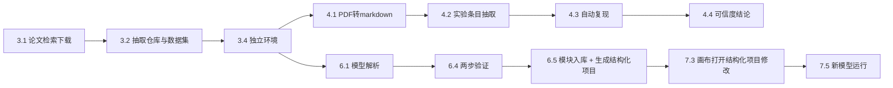
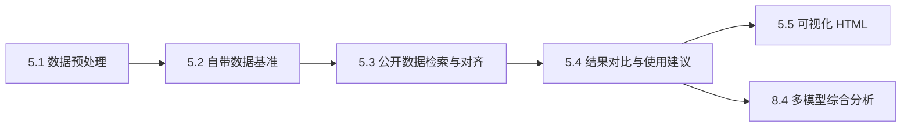
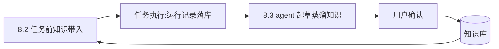

# 模块详细设计

| 项目 | 内容 |
|---|---|
| 文档版本 | v1.8 |
| 日期 | 2026-10-02 |
| 状态 | 评审通过 |
| 依据 | 《功能需求.md》《系统架构设计》《知识库与数据设计》 |
| 读者 | 开发人员、维护人员 |

| 版本 | 日期 | 修改说明 |
|---|---|---|
| v1.0 | 2026-09-26 | 初稿:基础服务设计、模块一~六详细设计、跨模块流程 |
| v1.1 | 2026-09-26 | 2.5 agent 调度改为 Claude Agent SDK 集成(Claude Code 为 agent 引擎);2.6 补充知识库 stdio MCP server 暴露 |
| v1.2 | 2026-09-26 | 2.5 模型端点收敛为 DeepSeek(官方 Anthropic 兼容端点优先)+ 网关工具调用协议翻译要求;2.5 异常与边界补充工具调用失败兜底 |
| v1.3 | 2026-09-26 | 项目类型区分(D12):2.2 原始项目/结构化项目两类工作区与类型权限;六.5 拆解生成结构化项目;七.2/七.4/七.6 画布与版本管理绑定结构化项目;九.1 流程同步 |
| v1.4 | 2026-10-01 | 阶段1 实施同步(M1 验收):三.5 明确宽限期跑通判定;二.3 明确环境创建步骤亦落 run_record;三.6 明确 nn.Module 子类兼容写法 |
| v1.5 | 2026-10-01 | 执行通道同步架构 v1.4:容器降级为可选扩展;二.3 决策树、七.1 复用清单、七.5 运行通道改为 conda/venv 子进程 |
| v1.6 | 2026-10-01 | 阶段2 实施同步(M2a 验收):五.6 新增模块三实施约定(eval 入口契约、统一 schema、alignment 结构、图表数据契约、对齐确认闸门);五.4 确认接口由 PUT 更正为 POST(对齐实现) |
| v1.7 | 2026-10-01 | 阶段2' 实施同步(M2b 验收):四.5 新增模块二实施约定(复现环境来源、复现产出口径与并行、条目确认闸门、对照阈值口径、表格 sidecar 与 `<br>` 规则、扫描版处理) |
| v1.8 | 2026-10-02 | 阶段3 实施同步:六章补缺失章标题「## 六、模块四」;六.3/六.4 接口路径与实现口径更正(再生成引擎定为后端 Python 单一实现、验证端点收拢 `/decompose/*`);六.6 新增模块四实施约定 |

## 一、文档说明与设计约定

### 1. 定位

本文档是需求到实现的直接映射,对《系统架构设计》定义的模块一~六与平台基础服务逐一展开详细设计。体量最大,按需求模块分章,每章末附需求逐条对照表。

### 2. 统一小节模板

每个功能点套用八项模板,以加粗标签行呈现:

- **目标**:本功能点要完成什么(一段话)。
- **输入/输出**:文件、数据结构、用户操作,列明来源与去向。
- **处理流程**:编号步骤,标注每步执行方——固定代码(脚本/后端逻辑)或 agent(调用大模型)。
- **接口**:HTTP API 定义、内部函数签名、文件协议。
- **关键设计**:核心算法、数据结构、决策规则。
- **与需求对照**:引用需求章节号,如"需求一.2"。
- **异常与边界**:失败场景与降级处理。
- **待决策项/开放项**:涉及的决定点编号(D-x/O-x),无则写"—"。

### 3. 引用约定

- 术语见《系统架构设计》一.4;schema 与数据目录见《知识库与数据设计》,本文档不再重复表结构,只引用表名。
- 待决策项与开放项仅用编号,定案见《系统架构设计》附录 A/B。
- 前端文件路径均为 frontend/ 下,后端为 backend/ 下;基底文件指 DL-Playground-main/ 中的对应路径。

## 二、基础服务设计

基础服务是需求一.2 与六.1 公共能力的提炼,供各功能模块调用,不面向用户单独呈现。

### 1. 任务管理

**目标**:承载所有长任务的调度与状态展示。

**输入/输出**:输入=任务创建请求(类型、参数);输出=任务状态与进度(前端轮询)。

**处理流程**:1) 功能模块提交任务(固定代码);2) 入队(排队 queued);3) 调度执行(running,更新进度);4) 结束置 success/failed,或用户取消置 cancelled。

**接口**:POST /api/tasks(创建)、GET /api/tasks/{id}(查询)、POST /api/tasks/{id}/cancel(取消)、POST /api/tasks/{id}/retry(重试)。

**关键设计**:状态机 queued → running → success/failed;running → cancelled;failed → retry → queued。任务表管调度状态,运行结果归 run_record,职责划分见《知识库与数据设计》五.2。

**与需求对照**:需求一.2(环境安装)、二.3(复现)、五.2(新模型运行)均为长任务,由本服务承载。

**异常与边界**:执行进程崩溃→任务标记 failed 并记录;超时→按任务类型超时上限终止。

**待决策项/开放项**:D2(后台任务队列)。

### 2. 项目管理与工作区

**目标**:为两类项目创建并维护项目工作区(D12):原始项目(original)与结构化项目(structured)。

**输入/输出**:输入=仓库地址/本地路径(原始项目)或拆解结果/画布新建(结构化项目);输出=项目记录与工作区目录。

**处理流程**:1) 创建项目记录(project_type、source、parent_project_id);2) 按类型建目录——原始项目:source/env/data/reports/runs;结构化项目:graph.json、runs/、exports/,工作区根初始化 git 仓库(7.6);3) 原始项目:代码克隆或挂载到 source/,后续模块在各子目录读写。

**接口**:POST /api/projects(创建,含 type 参数)、GET /api/projects/{id}、GET /api/projects(列表,按类型筛选)。

**关键设计**:本地路径用挂载或软链,避免重复拷贝;类型权限:分析/复现/拆解相关 API 仅接受原始项目,画布/版本/新模型运行相关 API 仅接受结构化项目,类型不符即拒绝;原始项目状态机 loading → env_ready → analyzed,随模块一进展流转;结构化项目自创建起按保存/运行产生版本(7.6)。

**与需求对照**:需求一.1(任意项目加载)、一.2(工作区承载环境与运行)、四.3(拆解生成结构化项目)、五.1(画布新建)。

**异常与边界**:克隆失败→任务 failed,记录错误并可重试;类型不符的 API 调用→400 并提示正确入口。

**待决策项/开放项**:D12。

### 3. 环境管理

**目标**:为每个项目创建独立环境并安装依赖,直至可运行(需求一.2)。

**输入/输出**:输入=项目工作区;输出=env/ 就绪环境与 env_install 运行记录。

**处理流程**:
1) 环境类型决策树(固定代码):项目自带 Dockerfile → 容器(可选扩展,需本机 docker;无 docker 时此分支不支持并明确提示);否则按 README 与依赖清单选 conda 或 venv;
2) 版本判断(固定代码):解析依赖清单与代码 import,确定语言版本、框架版本、CUDA 版本(需求一.2);
3) 按清单安装依赖(固定代码);
4) 依赖修正循环(固定代码 + agent):安装失败 → 解析报错定位失败包 → agent 判断代码实际用到的库(import 扫描 + 代码阅读)→ 降级或替换版本、移除未实际使用的项 → 重试;循环上限默认 3 次;
5) 仍失败 → 项目标记"环境不可用",原因写入运行记录。

**接口**:POST /api/projects/{id}/env(创建环境)、GET /api/projects/{id}/env(查询状态)。

**关键设计**:修正循环是环境能力的核心算法;环境创建步骤与每次安装尝试均生成运行记录(run_type=env_install,params.step 区分 env_create/pip_install),报错入 error 字段,供蒸馏知识提炼依赖冲突结论(需求六.1)。

**与需求对照**:需求一.2。

**异常与边界**:需要系统级依赖(编译工具链)→ agent 判断后提示或安装;CUDA 与驱动不匹配→记录并降级 CPU 运行。

**待决策项/开放项**:O4(修正循环中 agent 的判断 prompt)。

### 4. 检索与下载

**目标**:论文检索、仓库与数据集地址抽取、克隆与下载(需求一.1)。

**输入/输出**:输入=检索条件(关键词/作者/时间范围/论文库);输出=论文 PDF、代码仓库克隆、数据集本地副本及登记。

**处理流程**:
1) 论文检索(固定代码):调用 arXiv API、PubMed E-utilities、bioRxiv API,按条件返回结果列表,用户勾选后批量下载全文;
2) 地址抽取(agent):从论文正文与补充材料抽取 GitHub/GitLab 仓库地址、Zenodo/Figshare/Kaggle 数据集地址;
3) 下载(固定代码):仓库 git clone;数据集经 Zenodo/Figshare REST 或 Kaggle API 下载,并写入 dataset_registry(数据设计八.2)。

**接口**:GET /api/search/papers(检索)、POST /api/search/papers/download(下载)、POST /api/search/extract(地址抽取 agent 任务)。

**关键设计**:地址抽取为 agent 任务(JSON 输入输出);下载前用 git ls-remote 或 HTTP HEAD 验证地址可达。

**与需求对照**:需求一.1。

**异常与边界**:论文无代码仓库 → 记录"仅论文",不阻断分析;Kaggle 需 API key,凭证走配置注入(架构九.1);下载失败重试后记录。

**待决策项/开放项**:O4(抽取 prompt)。

### 5. agent 调度

**目标**:统一承载所有"agent 调用大模型"的复杂功能(D3、T3);agent 引擎为 Claude Code(依赖项),后端经 Claude Agent SDK for Python 调用。

**输入/输出**:输入=agent 任务定义(JSON);输出=任务结果(JSON,结构化输出)+ 日志。

**处理流程**:1) 功能模块构造任务定义(prompt、工作目录、工具白名单、输出 JSON Schema、轮数/预算上限);2) 入串行队列;3) 后端构造 Claude Agent SDK 会话(ClaudeAgentOptions:cwd=工作目录、add_dirs、allowed_tools、permission_mode=dontAsk/acceptEdits、output_format=JSON Schema(draft-07)、max_turns、mcp_servers=知识库 MCP);4) 取 ResultMessage.structured_output 校验,重试耗尽按失败处理;5) 任务输入输出与日志落盘。

**接口**:POST /api/agents/tasks(提交)、GET /api/agents/tasks/{id}。

**关键设计**:会话生命周期——每会话一个专属 asyncio.Task 持有 SDK client,经 asyncio.Queue 与 HTTP handler 桥接;或每请求用 query() 一次性调用(官方 issue #576 workaround)。模型端点(O2):默认直连 Anthropic API;可选 ANTHROPIC_BASE_URL 接 DeepSeek(选型收敛,优先官方 Anthropic 兼容端点 api.deepseek.com/anthropic,跳过第三方网关),需模型别名重映射(ANTHROPIC_DEFAULT_*_MODEL);经第三方网关时须忠实翻译工具调用协议(tool_use.id 不重写、流式不缓冲、beta 头原样透传),所选模型须具备可靠工具调用能力,启用前以 MCP 工具调用冒烟测试验收(架构八.1)。工具白名单:读文件(限工作区)、写文件(限工作区)、执行命令(经 conda run 限项目独立环境)、查询知识库(经每会话临时挂载的 MCP);deny 优先,白名单外能力不提供(架构八.1)。

**与需求对照**:需求引言段(复杂功能由 agent 调用大模型);动态分析(一.3)、地址抽取(一.1)、实验条目抽取(二.2)、模型拆解(四.1)、知识蒸馏(六.1)均经本服务。

**异常与边界**:asyncio.wait_for 整体超时并终止会话子进程;429 指数退避;结构化输出重试耗尽→任务 failed 落库;输出 schema 不合格→重试后标记失败;模型忽略/拒绝工具调用→任务 failed 落库,提示更换端点或模型;知识带入与冲突预警经后端直查知识库 API 兜底(2.6),不受工具调用失败影响。

**待决策项/开放项**:O2(端点配置)、O4。

### 6. 知识库读写

**目标**:四类数据入库与检索的接口层(架构八.5)。

**输入/输出**:输入=各模块的 ingest 调用;输出=检索结果。

**处理流程**:1) 接收 ingest 请求;2) 按 data_type 分发到对应表与文件目录;3) 事务内写入主表并同步 unified_index 与 FTS;4) 检索走 search 接口。

**接口**:见《知识库与数据设计》十清单,本服务负责实现:路由分发、事务、FTS 查询构造、unified_index 同步写入。

**关键设计**:入库与索引同步写,保证"先落库后检索"原则(数据设计一.2);同时以 stdio MCP server 形式暴露知识库查询能力,供 agent 会话每会话临时挂载(2.5)。

**与需求对照**:需求六.1。

**异常与边界**:写入失败→事务回滚,返回错误。

**待决策项/开放项**:D9、O1。

## 三、模块一:原始项目加载与代码分析

### 1. 论文检索下载

**目标**:按关键词、作者、时间范围检索并批量下载论文全文(需求一.1)。

**输入/输出**:输入=检索条件;输出=papers/{paper_id}/ 下 PDF 原文与 paper 记录。

**处理流程**:1) 调用检索与下载服务(2.4);2) 创建 paper 记录(status=downloaded,数据设计四.1);3) 写 unified_index。

**接口**:复用 2.4 接口。

**关键设计**:检索结果列表先展示后下载,避免误下;paper_id 优先用 arXiv id 等外部 id。

**与需求对照**:需求一.1。

**异常与边界**:付费墙/无权限论文 → 跳过并记录原因。

**待决策项/开放项**:—。

### 2. 代码仓库与数据集抽取

**目标**:从论文正文和补充材料自动抽出代码仓库地址与数据集地址(需求一.1)。

**输入/输出**:输入=论文 PDF 或 markdown;输出=仓库与数据集地址列表(JSON)。

**处理流程**:1) agent 任务抽取地址;2) 验证地址可达;3) 克隆代码到 projects/{id}/source/,下载数据集并登记 dataset_registry。

**接口**:复用 2.4 接口。

**关键设计**:抽取与验证分离,失效地址记录但不阻断论文分析流程。

**与需求对照**:需求一.1。

**异常与边界**:多仓库论文 → 全部列出,用户选择主仓库。

**待决策项/开放项**:O4。

**实施补充(v1.6)**:地址抽取落地为独立任务类型 `extract_addresses`,任务内对抽出的数据集地址逐个下载并登记 `dataset_registry`;**只有下载成功的数据集才登记**(登记表里放不可用条目会污染模块三的检索与对齐),失败地址连同原因记入任务进度,不阻断其余地址(3.2 异常与边界)。仓库地址只列出不自动克隆——多仓库论文由用户选择主仓库,克隆由 3.3 在用户指定 source 后执行。Kaggle 需 API key,当前按失败记录。地址解析支持 zenodo(records/record)、figshare(articles/.../{id})、kaggle(datasets/{owner}/{name});agent 结构化输出经 `result.json` 兜底、不经 schema 校验,条目可能是对象而非纯字符串,故取值做容错。

### 3. 任意项目加载

**目标**:直接提供深度学习项目的仓库地址或本地路径,走同一分析流程(需求一.1)。

**输入/输出**:输入=仓库地址或本地路径;输出=项目工作区与项目记录。

**处理流程**:1) 项目管理服务创建项目(2.2,project_type=original);2) 克隆或挂载;3) 进入 3.4 环境准备,后续流程与论文来源项目完全一致。

**接口**:POST /api/projects。

**关键设计**:本地路径挂载避免拷贝;来源标记(paper/local/repo)写入项目记录,支撑溯源;创建的项目类型为原始项目,不可在画布上修改(2.2 类型权限)。

**与需求对照**:需求一.1。

**异常与边界**:路径不存在/仓库不可访问 → 创建失败并提示。

**待决策项/开放项**:—。

### 4. 独立环境创建与依赖安装

**目标**:每项目单独环境,按清单装依赖并修正,互不干扰(需求一.2)。

**输入/输出**:输入=项目工作区;输出=就绪环境与安装运行记录。

**处理流程**:调用环境管理服务(2.3),无额外流程。

**接口**:复用 2.3 接口。

**关键设计**:环境类型决策树、版本判断、依赖修正循环见 2.3;每次安装尝试的运行记录是蒸馏知识"依赖冲突"的数据来源。

**与需求对照**:需求一.2。

**异常与边界**:见 2.3。

**待决策项/开放项**:—。

### 5. 最小可运行命令定位与运行验证

**目标**:定位最小可运行命令并跑通,验证代码可运行(需求一.2)。

**输入/输出**:输入=项目工作区+环境;输出=验证通过的运行记录(run_type=smoke_run)。

**处理流程**:
1) 候选命令提取(固定代码),优先级:README → 脚本目录(run.sh、train.py 等)→ `--help` 输出;
2) 逐条在独立环境执行;
3) 跑通判定(随项目类型):宽限期内进程正常结束则按退出码判定;训练类命令运行满宽限期且无导入/环境错误即判"启动成功"并终止进程;
4) 全失败 → agent 阅读代码尝试构造命令 → 仍失败则标记不可运行并记录原因。

**接口**:POST /api/projects/{id}/verify。

**关键设计**:三来源优先级对应需求原文"从 README、脚本目录或 --help 输出定位";跑通判定标准随项目类型区分(训练/推理/工具脚本)。

**与需求对照**:需求一.2。

**异常与边界**:需要数据集才能跑通 → 先下载(3.2)或使用自带样例数据。

**待决策项/开放项**:O4(构造命令的 agent prompt)。

### 6. 静态结构扫描

**目标**:静态扫描代码,产出结构分析报告(需求一.3)。

**输入/输出**:输入=projects/{id}/source/;输出=结构分析报告 JSON(reports/structure_report.json)。

**处理流程**:固定脚本 scripts/scan_structure.py:1) 文件扫描与 import 解析;2) 识别入口脚本、模型定义文件(继承 nn.Module 的类,兼容 nn.Module / torch.nn.Module / 裸 Module 写法)、训练/推理流程;3) 提取模块层级关系(类嵌套、调用链);4) 收集第三方依赖及版本要求;5) 产出报告。

**接口**:POST /api/projects/{id}/analyze(触发扫描)、GET /api/projects/{id}/report(取报告)。

**关键设计**:报告 schema:{entry_points[], model_files[], train_flow, inference_flow, module_hierarchy(树), dependencies[{name, version_spec, used_in}]};扫描无法确定的点(动态构建、条件分支)标记 uncertain,交由 3.7 补充。

**与需求对照**:需求一.3。

**异常与边界**:非 Python 项目 → 报告语言与结构,后续模块按能力降级提示。

**待决策项/开放项**:—。

### 7. 动态行为补充分析

**目标**:对静态分析无法确定的动态行为,由 agent 阅读代码补充判断(需求一.3)。

**输入/输出**:输入=结构分析报告(含 uncertain 标记)+ 代码路径;输出=补充说明 JSON,合并进报告。

**处理流程**:1) 扫描报告存在 uncertain 项 → 触发 agent 任务(经 2.5);2) agent 阅读相关代码,输出判断结果;3) 合并进 structure_report.json。

**接口**:内部 agent 任务,无独立 HTTP API。

**关键设计**:agent 只读代码、不改代码;每条补充记录代码位置与理由,保证可复核。

**与需求对照**:需求一.3。

**异常与边界**:agent 超时 → 该 uncertain 项保留原标记,报告仍可用。

**待决策项/开放项**:O4。

## 四、模块二:论文自动复现与可信度确定

### 1. PDF 转 markdown

**目标**:PDF 转 markdown,保留章节结构、表格、公式、图注(需求二.1)。

**输入/输出**:输入=papers/{paper_id}/ 下 PDF;输出=markdown 全文与 section_index(数据设计四.3)。

**处理流程**:1) 规则工具解析(固定代码,D5):PyMuPDF 文本提取,Grobid、Marker 类工具结构化解析;2) 表格、公式、图注由 agent 修正(经 2.5);3) 写 section_index(章节、表格、公式、图注位置索引);4) paper 记录更新(status=parsed)。

**接口**:POST /api/papers/{id}/parse。

**关键设计**:规则工具为主、agent 修正为辅(D5),不纯靠大模型保证文本保真;section_index 供 4.2 抽取与前端定位。

**与需求对照**:需求二.1。

**异常与边界**:扫描版 PDF 无文本层 → 标注质量并提示 OCR(预留)。

**待决策项/开放项**:D5、O4。

### 2. 实验条目抽取

**目标**:从方法和实验章节抽出实验条目(数据集、划分方式、评价指标、超参数、对比基线、论文报告数值)(需求二.2)。

**输入/输出**:输入=markdown + section_index;输出=experiment_item 列表(draft 状态,数据设计四.3)。

**处理流程**:1) agent 任务抽取(经 2.5);2) 条目写库(status=extracted,draft);3) 用户在界面确认或修改;4) 确认后条目生效。

**接口**:POST /api/papers/{id}/extract、PUT /api/papers/{id}/items/{item_id}(用户编辑)。

**关键设计**:六要素缺失时标注缺失而非臆造;用户可编辑保证抽取质量(需求二.2 的准确性要求)。

**与需求对照**:需求二.2。

**异常与边界**:无实验章节的论文(纯方法论文)→ 条目为空,流程正常结束。

**待决策项/开放项**:O4。

### 3. 自动复现执行

**目标**:在同一环境复现实验,拿到实际数值(需求二.3)。

**输入/输出**:输入=实验条目+模块一环境;输出=实际指标与运行记录(run_type=reproduce)。

**处理流程**:
1) 复现脚本生成(固定模板 + agent 填空,经 2.5):按条目的数据集、划分方式、超参、基线生成或改写运行命令;
2) 在模块一独立环境执行(复用架构八.3 运行执行机制);
3) 运行记录落库(数据设计五.4);
4) 实际指标写入 reproduction_result(数据设计四.3)。

**接口**:POST /api/papers/{id}/reproduce(触发)、GET /api/papers/{id}/reproduce(查询)。

**关键设计**:多条目在资源限额内并行;每次运行与条目一一对应,保证逐条对照可追溯。

**与需求对照**:需求二.3。

**异常与边界**:运行报错 → 记录 error,对照时归为"无法复现",不中断其他条目。

**待决策项/开放项**:O4(脚本填空 prompt)。

### 4. 逐条对照与可信度结论

**目标**:实际数值与论文报告值逐条对照,得出可信度结论(需求二.3)。

**输入/输出**:输入=reproduction_result 列表;输出=credibility_conclusion(数据设计四.3)。

**处理流程**:
1) 对照计算(固定代码):相对误差 deviation = |actual − reported| / |reported|(报告值的指标;相对量纲指标另行定义);
2) 分档判定(D6):一致(deviation ≤ 阈值)、近似、不一致、无法复现(无实际值);
3) agent 起草总体可信度结论(经 2.5),汇总各条目 verdict 与差异分析;
4) 用户可确认或修改;结论入库,paper 记录更新(status=concluded)。

**接口**:POST /api/papers/{id}/conclusion(生成)、PUT /api/papers/{id}/conclusion(确认/修改)。

**关键设计**:阈值默认值取统一相对阈值(如 5%),实施期按真实复现数据校准(O3);四档结论与《知识库与数据设计》四.3 verdict 字段一致。

**与需求对照**:需求二.3。

**异常与边界**:全部条目无法复现 → 结论为"无法复现",仍入库(架构九.4)。

**待决策项/开放项**:D6、O3。

### 5. 实施约定(阶段2' 落地补充)

本章四节的接口与产出物在实施期有若干文档未规定的约定(部分沿用五.6 先例);为避免代码与文档漂移,在此固化。

**1) 复现环境来源(4.3)**

4.3 输入「模块一环境」未规定如何选择。约定:`POST /api/papers/{id}/reproduce` 请求体携带 `project_id`(模块一项目),复现脚本在该项目的独立环境(`env/`,conda/venv)中执行;项目须为 `original` 类型且环境已就绪,否则任务失败并提示先完成环境创建。

**2) 复现产出口径(4.3)**

复现脚本采用「固定模板 + agent 填空」:平台将 `scripts/reproduce_template.py` 拷至 `runs/reproduce/{task_id}/reproduce.py`,agent 依据仓库代码原地实现 `reproduce(source_dir, item)`;平台按条目以固定签名调用 `python reproduce.py <source_dir> <item_json> <out_json>`,输出 `{metric_name, metric_value_actual, n_samples, log_tail}`。**每次运行与条目一一对应**:每条目一条 `run_record(run_type=reproduce)`(含 `environment` 与 `log_path`,日志全文落 `runs/`)与一条 `reproduction_result`。**多条目在资源限额内并行**(默认并发 3,`REPRODUCE_MAX_PARALLEL` 覆盖);某条目运行报错只记入该条对照并归「无法复现」,不中断其余条目——非 0 退出即视为无法复现(4.3 异常与边界)。重跑复现前清除该论文旧对照记录,避免结论重复计入。

**3) 实验条目确认闸门(4.2)**

4.2 的「确认后条目生效」实施为与 5.3 alignment 同形的闸门:抽取写库为 `extracted`(未确认),经 `POST /api/papers/{id}/items/{item_id}/confirm` 转 `confirmed`;**仅已确认条目参与复现**(未确认时不复现并明确报错)。`PUT /api/papers/{id}/items/{item_id}` 供用户编辑,亦可置 `status`。

**4) 逐条对照口径与阈值(4.4、D6)**

对照为固定代码:相对误差 `deviation = |actual − reported| / |reported|`(报告值为非数值或 0 时无法计算,归「不一致」)。分档默认:一致 `deviation ≤ 0.05`、近似 `≤ 0.20`、否则不一致,无实际值则「无法复现」;阈值经 `REPRO_DEVIATION_CONSISTENT` / `REPRO_DEVIATION_APPROX` 覆盖(O3 校准入口)。`passed_threshold` 仅一致档为 1。总体分档先以规则「有实际值条目中的最差档」兜底,再由 agent 起草 `summary`;agent 产出非法档位时回退规则档。

**5) 表格解析与抽取辅助(4.1、4.2)**

4.1 规则解析用 PyMuPDF 官方 markdown 转换器 pymupdf4llm(标题、表格、多栏阅读顺序在库内处理),并额外产出 `tables.json`(pdfplumber 抽取的表格二维网格)供 4.2 交叉核对——学术表多为无框线,pdfplumber 默认(lines)识别不到、text 策略可能并表,**故仅作参考、以 markdown 为准**。4.2 抽取在全文 markdown 上进行(上限 10 万字符:报告值多在下游结果表,截断会丢失报告值),并附表格标题与 `tables.json` 网格;markdown 表格单元格内的 `<br>` 表示原表该格内换行(常对应另一行数据),解析时按列语义区分。抽取结果按「指标/报告值/数据集/划分」四要素保守去重。

**6) 扫描版 PDF(4.1 异常与边界)**

无文本层时 `section_index.quality = "scanned"`,跳过 agent 修正;**OCR 仍为预留**(当前仅标注质量并在任务进度给出提示),与 4.1「预留」保持一致。

**与需求对照**:需求二.1、二.2、二.3。

## 五、模块三:原始模型的使用

### 1. 数据预处理与结构统一化

**目标**:按格式读取数据并统一字段命名、单位、标签,清洗缺失、重复、异常值(需求三.1)。

**输入/输出**:输入=原始数据(CSV、Excel、FASTA、PDB、图片、压缩包);输出=统一 schema 的预处理数据集 + 字段映射与标签归并表。

**处理流程**:
1) 格式识别与读取(固定脚本 scripts/preprocess_*.py):CSV/Excel 用表格解析,FASTA/PDB 用序列与结构解析,图片用图像加载,压缩包解包后按内容识别;
2) 字段命名与单位统一(固定规则 + agent 建议):映射到统一名称与量纲;
3) 标签归并:同一含义的不同写法归并到统一值(需求三.1);
4) 序列规范:统一长度范围与大小写;
5) 清洗:缺失值(填充或删除)、重复条目(去重)、异常值(检测与处理)。

**接口**:POST /api/preprocess(触发)、GET /api/preprocess/{id}(结果)。

**关键设计**:字段映射与标签归并表写入 dataset_registry.alignment(数据设计八.2),供跨数据集对齐与六.2 同口径复用;预处理脚本为固定脚本,满足 T4 约定。

**与需求对照**:需求三.1。

**异常与边界**:无法识别格式 → 提示并留待 agent 判断。

**待决策项/开放项**:—。

### 2. 自带数据基准运行

**目标**:加载权重,在自带数据上跑通基准(需求三.2)。

**输入/输出**:输入=模型权重+预处理自带数据;输出=基准指标与运行记录(run_type=baseline)。

**处理流程**:1) 定位权重(项目工作区或 checkpoint,经结构分析报告辅助);2) 预处理自带数据(5.1);3) 在模块一环境运行基准;4) 运行记录与指标落库。

**接口**:POST /api/projects/{id}/baseline。

**关键设计**:基准是后续对比的参照(需求三.2),指标口径与模块二复现指标保持可比。

**与需求对照**:需求三.2。

**异常与边界**:权重缺失 → 记录并提示先跑通模块一或复现。

**待决策项/开放项**:—。

### 3. 公开数据检索与跨数据集对齐

**目标**:自带数据不够用时检索其他开源数据,并把输入对齐(字段、序列长度、标签体系)(需求三.2)。

**输入/输出**:输入=任务类型与数据类型;输出=新数据集本地副本 + 对齐记录。

**处理流程**:1) 数据不足判定;2) 从公开数据入口(dataset_registry 已有 + 外部源)按任务类型与数据类型检索;3) 下载并登记(复用 2.4);4) 跨数据集对齐:字段映射、序列长度、标签体系(需求三.2),对齐规则由 agent 起草、用户确认;5) 更新 dataset_registry.alignment。

**接口**:GET /api/datasets/search、POST /api/projects/{id}/datasets/align。

**关键设计**:对齐记录可复用——同一数据集对同一项目只对齐一次,后续评估直接使用。

**与需求对照**:需求三.2。

**异常与边界**:无可用公开数据 → 提示并结束该步骤。

**待决策项/开放项**:O4(对齐规则起草 prompt)。

### 4. 结果对比与使用建议

**目标**:对比两组结果,指出表现差异与可能来源,给出使用建议(需求三.2)。

**输入/输出**:输入=基准结果+跨数据集评估结果;输出=对比报告与使用建议(usage_guidance 蒸馏知识 draft,数据设计六.1)。

**处理流程**:1) 对比表生成(固定代码):同指标并排;2) 差异分析(agent):指出哪类数据表现好/差,差异可能来自数据分布、输入适配等;3) agent 起草使用建议;4) 用户确认后作为蒸馏知识入库(数据设计六.3 状态机)。

**接口**:POST /api/projects/{id}/compare、POST /api/knowledge/confirm/{id}(蒸馏知识确认,2.6 已实现)。

**关键设计**:建议落库前必经用户确认,保证蒸馏知识质量。

**与需求对照**:需求三.2。

**异常与边界**:结果不可比(指标不同)→ 先做口径统一再对比。

**待决策项/开放项**:—。

### 5. 可视化脚本

**目标**:可视化呈现性能对比图、误差分布图、典型案例预测结果(需求三.2)。

**输入/输出**:输入=JSON 数据文件(基准与评估结果);输出=自包含 HTML 文件。

**处理流程**:固定脚本(scripts/visualize_performance.py、visualize_error_dist.py、visualize_cases.py):1) 读 JSON;2) 生成自包含 HTML(内嵌 ECharts 离线单文件,D4/D7);3) 后端返回文件路径,前端新标签页打开(T4)。

**接口**:POST /api/projects/{id}/visualize/{chart_type} → 返回 HTML 路径。

**关键设计**:三张图:性能对比图(分组柱状)、误差分布图(直方图/散点)、典型案例预测结果(表格+缩略图);脚本与前端 React 解耦,数据驱动。

**与需求对照**:需求三.2、引言段(T4)。

**异常与边界**:数据缺失某图所需字段 → 该图降级提示,不影响其他图。

**待决策项/开放项**:D4、D7。

### 6. 实施约定(阶段2 落地补充)

本章五节的接口与产出物在实施期需要三处文档未规定的约定;为避免代码与文档漂移,在此固化。

**1) 统一 schema 与 alignment 结构(5.1)**

预处理产出的数据集统一为固定列 `id / split / label / input`(input 为文本、路径或序列),原数据其余列透传为 `meta_<原名>`。写入 `dataset_registry.alignment` 的结构:

```
{
  "field_mapping": {"原列名": "统一字段"},
  "label_merge":   {"原标签写法": "归并后写法"},
  "sequence":      {"length_range": [最小, 最大], "case": "upper"},
  "units":         {"列名": "单位"},
  "version":       "1.0"
}
```

本阶段实现的格式为 **CSV / Excel(.xlsx) / 图片目录 / 压缩包(zip、tar)**;FASTA、PDB 与旧版 .xls 识别后返回「暂不支持」提示(接口位保留,后续阶段补齐)。清洗规则:按内容列哈希去重(排除生成的 id)、整行缺失过半删行、数值列中位数与非数值列众数填充、IQR 1.5 倍截断异常值。

**列名匹配**采用「整名精确 → 分词精确」两级,不做朴素子串匹配——否则 `y`、`id` 这类单字符别名会命中 `latency`、`valid` 等无关列名。

**量纲统一(5.1 步骤 2 的单位部分)**:列名带单位后缀的数值列换算到统一量纲并改名,规则为时间→秒、字节量→MB、比例→小数(如 `latency_ms`→`latency_s`、`acc_pct`→`acc_ratio`);换算明细记入 `alignment.units`。该后缀须以分隔符引导(`latency_ms`、`duration(s)`),避免误判 `Mass` 这类词尾。

**序列规范(5.1 步骤 4)**:判定为序列列时(纯字母占比 ≥0.8 且长度中位数 ≥10)**实际归一数据**——统一转大写,并把长度超过 IQR 上界的序列截断到该上界(不补齐短序列,补齐会凭空造数据),截断条数记入 `alignment.sequence.truncated` 与 `cleaning.sequences_truncated`。归一在清洗之前执行,异常值判定基于统一量纲后的数值。

**2) eval 入口契约与指标口径(5.2)**

基准运行不引入 agent,采用「约定式 eval 入口」:项目在 `source/eval_entry.py` 提供入口,平台以固定代码调用

```
python eval_entry.py <data_dir> <model_dir> <out_json>
```

`data_dir` 为预处理产物目录,`model_dir` 为平台定位到的权重目录(未定位到则为空串),`out_json` 为指标输出路径。权重定位先扫项目文件,再由模块一的 `reports/structure_report.json` 辅助——报告中提到的权重路径(可能是 `source/` 之外的相对路径)若实际存在则一并采纳。入口缺失时平台生成模板到 `runs/eval_entry.py` 并明确失败提示,不静默兜底。权重缺失时记录 `weights_found=false` 后仍执行(部分项目的权重路径写在代码内),但**运行失败且未发现权重时**,错误信息附带「先跑通模块一(结构分析)确认权重位置」的提示(5.2 异常与边界)。

指标 JSON 的 `metrics` 键名须取自规范指标集(accuracy/precision/recall/f1/auc/mae/rmse/loss 等,见 `backend/app/contracts.py::CANONICAL_METRICS`),**这是 5.2「基准指标与模块二复现指标保持可比」的落地点**——模块二(4.4)计算指标时必须复用同一套键名,否则 5.4 无法对比。平台侧对别名(如 `acc`、`macro_f1`)做归一后写入 `run_record.metrics`。

**3) 跨数据集评估运行与对齐规则来源(5.3、5.4)**

5.4 的输入「跨数据集评估结果」在文档中未指定产出方;实施期定为:在 5.4 对比时对已对齐数据集触发评估运行,复用 5.2 的 eval 入口契约,`run_type=eval`。因此 5.3 只产出对齐记录,不跑评估。

**数据不足判定(5.3 步骤 1)**:`GET /api/datasets/search` 传入 `project_id` 时,先按自带数据的样本数对比阈值判定(默认 **100** 条),结果置于响应的 `self_data`;数据不足时给出「建议检索公开数据补充」的提示。同一响应会把项目自带数据集从 `local` 中排除(5.3 检索的是自带之外的可用数据)。`local` 与 `external` 均为空时,响应附 `hint`「无可用公开数据,该步骤结束」(5.3 异常与边界)。

**数据集登记去重**:无项目的预处理输出目录按输入路径哈希固定(而非按 task_id),使同一文件重复预处理落到同一 `local_path`,`upsert_dataset` 得以按 name+local_path 命中更新,不会重复登记。

5.3 的对齐规则以 agent 起草为主;agent 无有效产出时退回固定规则(统一字段同名映射 + 标签大小写不敏感归并),并在 `alignment.drafted_by` 记录来源(`agent` / `rule_fallback`)。**若兜底后仍无任何映射则任务失败**,不写入对齐记录——此时目标数据集通常尚未预处理(外部下载的数据集须先经 5.1 预处理),失败提示会给出该指引;否则会写入空记录并标记为「已对齐」,而 Re-align 会被复用规则跳过,问题直到 5.4 对比阶段才暴露。对齐记录按「数据集 × 项目」复用,`alignment.aligned_projects` 记录已对齐项目。

对齐记录会被后续评估**自动复用**,故 5.3「用户确认」实施为与蒸馏知识同形的确认闸门:`alignment.status` 取 `draft`(agent 起草后)或 `confirmed`(经 `POST /api/datasets/{dataset_id}/alignment/confirm` 确认,同时写 `confirmed_at`);**未确认的对齐不参与 5.4 结果对比**,对比任务会明确报出未确认的数据集名。

5.1 的 `POST /api/preprocess` 不带 project 前缀(文档原约定),与 5.2~5.4 的 `/api/projects/{id}/...` 风格不一致,实施期保留文档约定。

**4) 图表数据契约(5.5)**

三张图的固定脚本统一签名 `python visualize_<x>.py <input.json> <out.html> <echarts.min.js 路径>`,图表数据 JSON 结构:

| 图 | 输入 JSON 关键字段 |
|---|---|
| 性能对比 | `metrics` (指标名列表)、`series` (各运行 `{name, values:{指标:值}}`) |
| 误差分布 | `values` (逐样本误差或 1-置信度)、`bins`、`scatter`(可选,真值-预测对) |
| 典型案例 | `cases` (逐样本 `{id, y_true, y_pred, prob, path, correct}`) |

ECharts 离线单文件放置于 `backend/app/vendor/echarts.min.js`;产出的 HTML 内嵌图表库与数据、无任何外链。某图缺字段时输出「降级提示」页,其余图不受影响。

**与需求对照**:需求三.1、三.2。

## 六、模块四:模型的拆解、可视化、再生成、验证与入库

### 1. 模型解析与节点映射

**目标**:解析模型定义,识别层级结构,映射成可视化节点,记录连接关系与参数形状(需求四.1)。

**输入/输出**:输入=模型定义文件(经结构分析报告定位);输出=模型 IR(JSON)。

**处理流程**:1) agent 任务解析模型定义(经 2.5);2) 输出 IR:nodes[{id, class_name, params, parent_id}]、edges[{from, to, tensor_shape}]、层级树;3) 每个继承 nn.Module 的类=一个节点,模块可展开显示内部层级(需求四.1);4) 用户可手动调节层级参数,回写 params。

**接口**:POST /api/projects/{id}/decompose(触发)、GET /api/projects/{id}/ir、PUT /api/projects/{id}/ir/nodes/{node_id}(调参)。

**关键设计**:IR 是拆解模块的核心数据结构,思想与基底 graphIR 一致(7.1);参数形状缺失时经 trace 补充(复用基底 trace 模式)。拆解与调参发生在原始项目;画布修改仅限结构化项目(六.5 生成,2.2 类型权限)。

**与需求对照**:需求四.1。

**异常与边界**:动态构建的模块 → agent 给出静态等价描述,标注不确定性。

**待决策项/开放项**:O4。

### 2. 可视化展示

**目标**:画出结构图和数据流图,每一层能看到输入输出形状(需求四.1)。

**输入/输出**:输入=模型 IR;输出=前端结构图与数据流图(专用查看器)。

**处理流程**:1) 后端返回 IR;2) 前端图渲染:结构图(层级树布局)与数据流图(连接布局,复用 dagre/elkjs);3) 节点上展示输入输出形状(tensor_shape)。

**接口**:GET /api/projects/{id}/ir。

**关键设计**:形状展示是"每一层能看到输入输出形状"的直接实现;渲染复用基底图布局能力,不新增渲染引擎。

**与需求对照**:需求四.1。

**异常与边界**:形状缺失的边 → 标注"未知",待 trace 补充。

**待决策项/开放项**:—。

### 3. 代码再生成

**目标**:按记录的连接关系重新生成代码(需求四.2)。

**输入/输出**:输入=模型 IR;输出=再生成的 PyTorch 代码(继承 nn.Module 的类)。

**处理流程**:1) 按 IR 连接关系生成代码(后端 Python 单一确定性引擎,见 6.6 约定 2);2) 生成产物为验证输入,不直接入库。

**接口**:POST /api/projects/{id}/decompose/regenerate → 同步返回代码;IR 不完整 → 400 附缺失项清单。

**关键设计**:再生成代码与原始定义同构是两步验证的前提;IR 与画布 GraphIR schema 不同,引擎为后端单一实现,前端不移植生成逻辑。

**与需求对照**:需求四.2。

**异常与边界**:IR 不完整 → 拒绝生成并提示补齐。

**待决策项/开放项**:—。

### 4. 两步验证

**目标**:结构比对 + 数值比对,保证重组与原始模型一致(需求四.2)。

**输入/输出**:输入=原始模型+再生成代码+模块一环境;输出=verification 记录(数据设计七.1)。

**处理流程**:
1) 结构比对(固定代码,复用基底 utils/shape_verifier.ts 思想,实际实现为 scripts/verify_decompose.py 宿主编排):逐层对应、层数、参数量、张量形状;
2) 数值比对(同脚本,项目环境执行):相同输入下两模型输出张量在设定阈值内一致;多组随机种子输入;
3) 全通过 → 验证通过;否则定位差异层,记录失败原因。

**接口**:POST /api/projects/{id}/decompose/verify(触发,任务异步)、GET 同路径(最近结果)。

**关键设计**:数值比对阈值与 D6 可信度阈值相互独立,默认取浮点容差;验证记录随模块包保存(数据设计七.1 verification 字段),保证入库模块可溯源。

**与需求对照**:需求四.2。

**异常与边界**:验证失败 → 模块不入库,记录失败原因供后续 agent 改进(架构九.4)。

**待决策项/开放项**:—。

### 5. 标准化模块入库

**目标**:验证通过的模块转为标准化模块,导入知识库统一管理(需求四.3)。

**输入/输出**:输入=验证通过的 IR+代码+验证记录;输出=模块包与统一索引条目。

**处理流程**:1) 生成模块包(module.py + module.json,数据设计七.1);2) module.json 由 IR、项目元信息、验证记录自动填充;3) 经知识库服务 ingest;4) 生成结构化项目(project_type=structured、parent_project_id=原始项目、graph.json=验证通过的 IR,2.2);5) 模块五画布可见。

**接口**:POST /api/modules(入库)、GET /api/modules(清单,供模块五拉取)。

**关键设计**:元信息(来源项目、任务类型、输入输出规格、标签)按需求四.3 逐项落 module.json;入库后模块进入统一索引(数据设计三.1)。

**与需求对照**:需求四.3。

**异常与边界**:重复模块(同项目同结构)→ 提示已有,支持覆盖为新版本。

**待决策项/开放项**:D10。

### 6. 实施约定(阶段3 落地补充)

本章各节的接口与产出物在实施期有若干文档未规定的约定(沿用四.5/五.6 先例);为避免代码与文档漂移,在此固化。

**1) 端点收拢与入口类指定(6.1、6.3、6.4)**

模块四全部端点收拢在 `/decompose/*` 前缀下(原设计 6.4 路径 `/verify` 与模块一验证端点冲突,analysis.py 已占用)。`POST /api/projects/{id}/decompose` 请求体可携带 `entry_class` 指定入口模型类(多根类仓库的歧义规避,论文库二次验证等场景);未指定时由 agent 按 module_hierarchy 判定。拆解前置:structure_report.json 存在(模块一产物),否则任务失败。

**2) 再生成引擎为后端 Python 单一实现(6.3)**

引擎为 `backend/app/services/ir_codegen.py`(纯函数,无 subprocess):叶子白名单直接实例化 `nn.X(**params)`;自定义 module 每节点输出独立类(自包含、不 import 源项目);container → nn.Sequential;op → code_hint 内联;按拓扑序生成 forward。IR 与画布 GraphIR schema 不同,前端不移植生成逻辑,与 6.3 关键设计一致。

**3) 验证阈值与脚本退出码约定(6.4)**

数值比对阈值经 env 覆盖:`DECOMPOSE_NUM_RTOL=1e-5`、`DECOMPOSE_NUM_ATOL=1e-6`、`DECOMPOSE_NUM_SEEDS="42,1337,2024"`(仿 REPRO_DEVIATION_* 先例)。验证脚本 `scripts/verify_decompose.py` 在项目环境执行(宿主编排):**比对不过=0 退出**(业务结果在 JSON),脚本异常 ≠0;验证不过任务本身 success、run_record(status=failed, error=failure_reason)可检索供 agent 改进。

**4) 形状回填与 ir_hash 新鲜度(6.1、6.2)**

形状缺失经 `scripts/trace_shapes.py` 补回(项目环境跑模型 hook,按 module_path 锚点回填)。验证记录内含 `ir_hash`(sha256 规范化 IR,不含形状);`PUT /ir/nodes/{id}` 调参后旧验证经 ir_hash 变 stale,入库前强校验须为 valid。

**5) module_id / 版本与统一索引(6.5)**

`module_id = "mod_" + sha256(结构签名)[:16]`(签名=入口类+input_spec+节点(类名,排序参数)+边(类对),不含 id/位置/形状);同 id 重复入库递增版本 `v1, v2, …`(module 表复合主键 (module_id, module_version))。unified_index 的 `ref_id = "{module_id}:{module_version}"`。

**6) 结构化项目与 source_paper_id(6.5)**

入库同时生成结构化项目:`create_project("structured", source="decompose", parent_project_id=原始项目)`,工作区根写 `graph.json`(画布 GraphIR v2 格式,由 IR 确定性转换),status=ready,模块五画布可见;**git 版本仓库归阶段4**。`source_paper_id` 本阶段置 null(project 表无论文关联列,阶段4 回填)。

**7) 入口类实例化兜底(trace/verify 前置)**

项目环境实例化入口类(scripts/_model_loader.py):无参优先,兜底依次尝试 `{"num_classes":10}`、`{"num_labels":10}`、`{"n_classes":10}`、`{"sizes":[64,128,10]}`、`{"dims":[64,128,10]}`、`{"hidden_size":64}`;env `DECOMPOSE_ENTRY_ARGS`(JSON)前置覆盖。

**与需求对照**:需求四.1、四.2、四.3。

## 七、模块五:可视化的深度学习自建(基于 DL-Playground)

### 1. 基底现状与魔改策略

**目标**:明确对基底 DL-Playground 的复用、改造与新增范围(T2),指导实施。

**输入/输出**:—。

**处理流程**:按以下三张清单实施,魔改原则见《系统架构设计》六.2(增量扩展,不重写)。

**关键设计**:

| 类别 | 对象(基底路径) | 说明 |
|---|---|---|
| 复用 | frontend/src/nodes/registry.ts 及 8 个节点组、node_gen/ | 标准节点库底座 |
| 复用 | frontend/src/utils/codeCompile.ts、shape_verifier.ts、graphIR.ts、layout.ts | 代码生成、形状校验、图 IR、布局引擎 |
| 复用 | frontend/src/features/editor/ 组件与 9 个 hooks | 画布与编辑交互 |
| 复用 | backend/worker.py 的执行逻辑 | 运行执行机制基础(架构八.3);runner.py 的 docker 模式为可选扩展 |
| 改造 | frontend/src/utils/moduleRegistry.ts(localStorage 持久化) | 改为后端 API 拉取与提交,接模块四.3(D10) |
| 改造 | frontend/src/utils/traceService.ts(硬编码 BASE_URL) | 地址可配置 + 扩展为通用运行任务通道(7.5) |
| 改造 | backend/runner.py | 保留 /api/torchlens,新增 projects/environments/modules/runs/versions/knowledge 路由 |
| 新增 | 标准化模块导入面板、版本管理 UI、新模型运行面板、任务状态轮询 | 需求五.2、五.3、N5 |

**与需求对照**:需求五.1(以 DL-Playground 作为基底进行魔改)。

**异常与边界**:基底升级 → 按《系统架构设计》六.2 合并上游,不覆盖魔改点清单。

**待决策项/开放项**:—。

### 2. 节点库与画布编辑

**目标**:常见深度学习模块做成画布节点,拖拽连线搭网络,节点上直接编辑(需求五.1)。

**输入/输出**:输入=用户画布操作;输出=网络定义(节点/边/参数)。

**处理流程**:基底已具备:拖拽、连线、改参数、复制、删除、成组、节点库检索与分类、连线形状校验与提示、按模块类型的参数面板。增强点:1) 节点库检索接入知识库标准化模块(7.3);2) 形状校验提示文案中文化与原因定位;3) 成组网络可整体保存;4) 画布仅打开结构化项目(六.5 生成或画布新建,2.2),原始项目不可在画布打开或修改(其可视化走六.2 只读查看器)。

**接口**:前端内部状态,不新增 API。

**关键设计**:形状校验复用 shape_verifier(需求五.1"连线做形状校验,不匹配时提示");参数面板按节点类型给出可调项,与 module.json params_schema 联动(7.3)。

**与需求对照**:需求五.1。

**异常与边界**:对原始项目发起画布打开/修改请求→拒绝并提示;仅结构化项目可画布编辑(2.2 类型权限)。

**待决策项/开放项**:—。

### 3. 拆解模块拼接新模型

**目标**:从标准化模块库选取模块,与标准节点混拼成新模型(需求五.2)。

**输入/输出**:输入=标准化模块+标准节点;输出=新网络定义。

**处理流程**:1) 前端经 GET /api/modules 拉取模块清单,注入改造后 moduleRegistry;2) 标准化模块以节点形式进节点库,与标准节点混拼;3) 模块节点参数面板由 module.json params_schema 生成;4) 连线形状校验用 input_spec/output_spec。

**接口**:GET /api/modules。

**关键设计**:SavedModule 结构兼容(D10),基底 ModuleRefNode 无需改动;模块节点展开可显示内部层级(与需求四.1 一致)。

**与需求对照**:需求五.2、四.3(供第五部分拼接)。

**异常与边界**:模块版本更新 → 画布引用旧版本保留(数据设计七.3),可手动升级。

**待决策项/开放项**:D10。

### 4. 网络保存与代码导出

**目标**:搭好的网络可保存,可导出成可执行代码(需求五.1、五.2)。

**输入/输出**:输入=网络定义;输出=后端持久化的网络 JSON + 可执行代码。

**处理流程**:1) 保存:网络定义(节点/边/参数)提交后端持久化,并触发 git 提交(7.6);2) 导出:复用基底 codeCompile 生成可执行代码,前端展示、可下载;3) 画布新建模型时先创建结构化项目(2.2),保存即更新其 graph.json。

**接口**:POST /api/networks(保存)、GET /api/networks/{id}/export(导出)。

**关键设计**:网络即结构化项目,network_id 即结构化项目 project_id(2.2);保存与版本管理联动——每次保存生成版本节点(需求五.3);导出代码为可执行 PyTorch 代码(需求五.1)。

**与需求对照**:需求五.1、五.2。

**异常与边界**:导出时代码生成失败 → 提示具体节点,不阻断保存。

**待决策项/开放项**:—。

### 5. 新模型运行

**目标**:新模型运行,复用第三部分的数据预处理与第一部分的独立环境能力(需求五.2)。

**输入/输出**:输入=网络定义+数据集+目标环境;输出=训练运行记录与指标(run_type=train)。

**处理流程**:1) 选择数据集(经 5.1 预处理)与项目环境(2.3);2) 导出代码+运行配置提交通用运行通道(改造后 traceService/runner);3) 后台执行,任务轮询(2.1);4) 运行记录落库。

**接口**:POST /api/networks/{id}/run。

**关键设计**:运行通道是基底 worker 子进程模式的扩展,在项目独立环境(conda/venv)中执行(架构八.3);运行记录满足需求六.1 模型运行数据。

**与需求对照**:需求五.2。

**异常与边界**:环境不可用 → 引导先走模块一准备环境。

**待决策项/开放项**:—。

### 6. 版本管理可视化

**目标**:每次保存或运行生成版本节点,版本树呈现,任意两版本对比,可回退且回退记为新版本(需求五.3)。

**输入/输出**:输入=网络保存/运行事件;输出=版本树、对比视图、回退操作。

**处理流程**(D8 落地):
1) 结构化项目创建时初始化 git 仓库(backend 子进程,2.2);
2) 每次保存或运行 = git commit;版本元数据(network_version.json:输入输出规格、运行结果摘要)随提交;
3) 前端版本树:经 API 读 git 提交历史渲染(图/树,显示版本演化关系);
4) 任意两版本对比:git diff 展示代码差异 + 参数差异表格;
5) 回退:检出目标历史版本为当前工作状态,用户继续编辑;回退动作本身记为新提交(需求五.3)。

**接口**:GET /api/versions/{network_id}/tree、GET /api/versions/{network_id}/compare?v1=&v2=、POST /api/versions/{network_id}/rollback。

**关键设计**:直接调用 git CLI,前台只负责显示(需求五.3、D8);版本元数据 JSON 随仓库提交保证版本与元信息一致。

**与需求对照**:需求五.3。

**异常与边界**:git 操作失败(冲突等)→ 错误透出,不静默。

**待决策项/开放项**:D8。

## 八、模块六:自迭代与多模型综合分析

### 1. 统一索引与检索界面

**目标**:四类数据统一索引,可按任务类型、模型、数据集检索(需求六.1)。

**输入/输出**:输入=检索条件;输出=检索结果列表。

**处理流程**:1) 前端检索界面:类型/任务类型/模型/数据集筛选 + 关键词;2) 调知识库服务 search 接口;3) 结果按类型分栏展示,可进详情。

**接口**:复用《知识库与数据设计》十 search 接口。

**关键设计**:索引与入库同步(2.6),检索结果直接可读;按数据设计三.1 统一索引表实现多维度过滤。

**与需求对照**:需求六.1。

**异常与边界**:—。

**待决策项/开放项**:O1(语义检索二期)。

### 2. 任务前知识带入

**目标**:新任务开始先检索已有知识,把相关经验带进流程:推荐参数、绕开依赖冲突(需求六.1)。

**输入/输出**:输入=新任务描述(任务类型、模型、数据集);输出=带入建议(参数推荐、冲突预警)。

**处理流程**:
1) 触发点(固定代码):模块一加载新项目、模块三新数据集评估、模块五新模型运行;
2) POST /api/knowledge/bring 按任务类型/模型/数据集检索蒸馏知识;
3) 参数推荐(param_advice)默认填入参数面板或命令模板,用户可改;
4) 依赖冲突预警(dependency_conflict)在安装依赖前提示绕开方案(2.3 修正循环优先采用)。

**接口**:POST /api/knowledge/bring(数据设计三.3)。

**关键设计**:带入为建议而非强制,用户可忽略;冲突预警直接改善 2.3 修正循环成功率。

**与需求对照**:需求六.1。

**异常与边界**:无命中知识 → 静默跳过,不打扰。

**待决策项/开放项**:—。

### 3. 任务后蒸馏入库

**目标**:任务结束后把新得到的结论提炼入库(需求六.1)。

**输入/输出**:输入=本次任务运行记录与历史知识;输出=新蒸馏知识(draft → confirmed)。

**处理流程**:1) 触发(固定代码):任务成功或失败结束;2) agent 起草结论(经 2.5),依据本次 run_record 与相关历史知识;3) draft 入库;4) 与已确认知识冲突检测,冲突时提示并支持 superseded(数据设计六.3);5) 用户确认 → confirmed。

**接口**:POST /api/knowledge/ingest(draft)、POST /api/knowledge/confirm/{id}。

**关键设计**:依赖冲突、复现不一致等结论的素材直接来自运行记录 error 字段(数据设计五.4),提炼有据可查(溯源原则)。

**与需求对照**:需求六.1。

**异常与边界**:agent 提炼为空 → 不产生知识条目。

**待决策项/开放项**:O4。

### 4. 多模型综合分析(扩展)

**目标**:统一同口径比较多个模型预测,找一致与分歧样本,分析分歧来源,融合并对比指标,结论蒸馏入库(需求六.2)。

**输入/输出**:输入=多模型预测结果+dataset_registry.alignment;输出=综合分析报告+fusion_insight 蒸馏知识。

**处理流程**:
1) 同口径统一(固定代码):输出格式、标签体系、评价指标按 alignment 统一(数据设计八.2);
2) 一致/分歧样本识别(固定代码):逐样本比对预测标签;
3) 分歧归因(agent):差异来自模型结构、训练数据还是输入适配;
4) 融合(固定代码):投票、加权平均或取交集,按任务类型可选;
5) 融合前后指标对比(固定代码);
6) 结论(适用场景、分歧原因、融合策略效果)作为蒸馏知识入库(数据设计六.1 fusion_insight)。

**接口**:POST /api/analysis/multi-model、GET /api/analysis/{id}。

**关键设计**:同口径依赖模块三.5.3 的对齐记录,不重复对齐;扩展能力独立部署,不影响一期主线(架构 N4)。

**与需求对照**:需求六.2。

**异常与边界**:标签体系无法统一 → 报告不可比部分,可比的继续。

**待决策项/开放项**:—。

## 九、跨模块流程设计

### 1. 推荐路径端到端:论文 → 复现 → 拆解 → 拼接新模型



图9-1 推荐路径(先复现确认可信再拆解入库,对应需求四推荐顺序)

### 2. 多数据集对比 → 综合分析端到端



图9-2 多数据集评估与综合分析

### 3. 知识带入 → 运行 → 蒸馏回写闭环



图9-3 自迭代闭环(对应需求六.1 与架构七.4)

## 附录:需求追溯矩阵

| 需求章节 | 需求要点 | 设计章节 | 状态 |
|---|---|---|---|
| 需求引言段 | agent 调大模型、固定脚本+HTML | 2.5、5.5 | 已设计 |
| 需求一.1 | 论文检索下载、地址抽取、任意项目加载 | 3.1、3.2、3.3(2.4 支撑) | 已设计 |
| 需求一.2 | 独立环境、依赖修正、最小命令验证 | 2.3、3.4、3.5 | 已设计 |
| 需求一.3 | 静态扫描 + agent 动态补充 | 3.6、3.7 | 已设计 |
| 需求二.1 | PDF 转 markdown 保留章节/表格/公式/图注 | 4.1 | 已设计 |
| 需求二.2 | 实验条目抽取 | 4.2 | 已设计 |
| 需求二.3 | 自动复现与逐条对照、可信度 | 4.3、4.4 | 已设计 |
| 需求三.1 | 数据预处理与结构统一化 | 5.1 | 已设计 |
| 需求三.2 | 基准、公开数据、对齐、对比建议、可视化 | 5.2、5.3、5.4、5.5 | 已设计 |
| 需求四.1 | 模型拆解与可视化、节点可展开可调参 | 6.1、6.2 | 已设计 |
| 需求四.2 | 再生成代码、两步验证 | 6.3、6.4 | 已设计 |
| 需求四.3 | 标准化模块入库与元信息 | 6.5 | 已设计 |
| 需求五.1 | 可视化编程、DL-Playground 魔改 | 7.1、7.2、7.4 | 已设计 |
| 需求五.2 | 拆解模块拼接新模型、复用预处理与环境 | 7.3、7.5 | 已设计 |
| 需求五.3 | 版本管理可视化(git) | 7.6 | 已设计 |
| 需求六.1 | 四类数据入库、统一索引、知识带入与蒸馏 | 2.6、8.1、8.2、8.3 | 已设计 |
| 需求六.2 | 多模型综合分析(扩展) | 8.4 | 已设计 |
