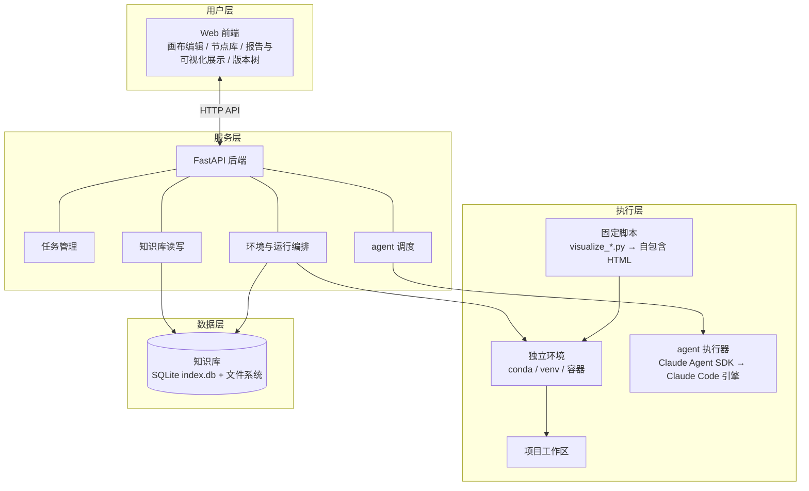
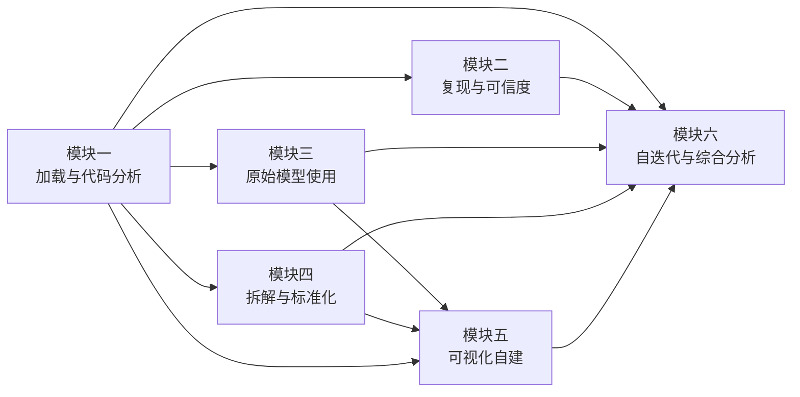
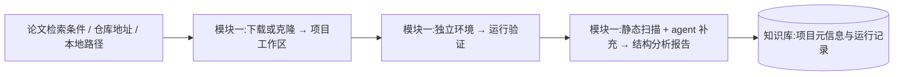
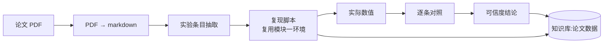
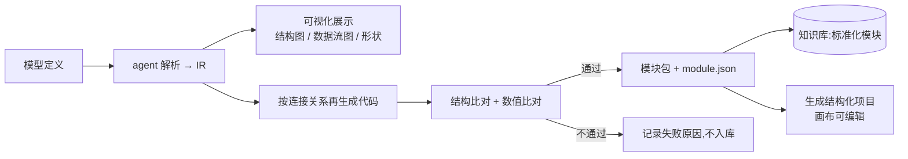
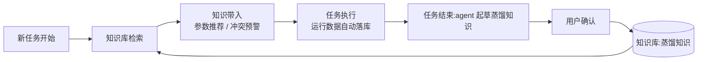

# 系统架构设计

| 项目 | 内容 |
|---|---|
| 文档版本 | v1.5 |
| 日期 | 2026-10-02 |
| 状态 | 评审通过 |
| 依据 | 《功能需求.md》 |
| 读者 | 开发人员、维护人员、项目评审人员 |

| 版本 | 日期 | 修改说明 |
|---|---|---|
| v1.0 | 2026-09-26 | 初稿:总体架构、模块划分、技术栈选型、目录结构、数据流、关键机制、非功能设计、部署方式 |
| v1.1 | 2026-09-26 | 产品形态定案(D11);agent 编排修订(D3):Claude Code 作为依赖项与 agent 引擎(经 Claude Agent SDK),移除自研 LLMClient;O2 定案:经 ANTHROPIC_BASE_URL 网关接国内大模型 |
| v1.2 | 2026-09-26 | 八.1 模型端点(O2)收敛为 DeepSeek 选型(官方 Anthropic 兼容端点优先)+ 网关工具调用协议翻译要求,以 MCP 工具调用冒烟测试为验收项;十.2、附录B O2 同步 |
| v1.3 | 2026-09-26 | 新增 D12:项目类型区分(原始项目仅分析与运行、结构化项目画布可编辑);术语表、三.4、四.2、六.3、七.3 同步 |
| v1.4 | 2026-10-01 | 执行通道定案:容器降级为可选扩展(需本机 docker),默认执行走项目独立环境(conda/venv)子进程;术语表、五.2/五.4(D2)、八.1/八.2/八.3、九.1、十.2 同步 |
| v1.5 | 2026-10-02 | 附录B 关闭 O4:模块一~四各 agent 任务 prompt 已随服务代码定稿,后续迭代随各模块实施同步 |

## 一、文档说明

### 1. 目的与范围

本文档定义 DL-AI-skills 的系统总体架构,范围包括:总体架构与分层、模块划分与边界、技术栈选型、代码仓库目录结构、核心数据流、关键机制、非功能设计与部署方式。

本文档是《知识库与数据设计》《模块详细设计》《开发计划》的术语与结构基础:术语以本文档一.4 为准,技术决策以本文档附录 A 定案为准,其余文档仅引用编号。

### 2. 读者对象

开发人员、维护人员与项目评审人员。阅读《模块详细设计》前应先阅读本文档第三、四章。

### 3. 与《功能需求》的关系

《功能需求.md》(下称需求)是唯一权威需求来源。本文档不新增、不变更需求,仅将需求落为架构设计。需求未明确的技术决策,本文档以"待决策项 D-x"定案并给出推荐方案;需要实施期实践校准的内容以"开放项 O-x"记录,不阻塞设计。汇总见附录 A、附录 B。

### 4. 术语表

| 术语 | 说明 |
|---|---|
| 原始项目 (original project) | 用户加载的论文对应代码仓库,或任意深度学习项目;仅承载分析与运行(模块一~四),不可在画布上修改 |
| 结构化项目 (structured project) | 拆解验证通过后生成的画布可编辑项目(内容=验证通过的模块图),或画布新建的网络项目;承载模块五操作(D12) |
| 项目工作区 (project workspace) | 每个项目在 data/projects/ 下的专属目录;原始项目含 source/env/data/reports/runs,结构化项目含网络定义、运行产物与 git 版本仓库(数据设计八.1) |
| 独立环境 (isolated environment) | 每个项目单独的 conda 或 venv 环境;容器为可选扩展(需本机 docker,见八.2) |
| 结构分析报告 (structure analysis report) | 模块一静态扫描加 agent 补充后产出的 JSON 报告 |
| 实验条目 (experiment item) | 从论文抽取的可复现实验单元:数据集、划分方式、评价指标、超参数、对比基线、论文报告值 |
| 可信度结论 (credibility conclusion) | 逐条对照后对论文可信度的分档结论 |
| 基准运行 (baseline run) | 原始模型在自带数据上的参考运行 |
| 标准化模块 (standardized module) | 模块四拆解并经两步验证通过后入库的模块 |
| 模块包 (module package) | 标准化模块的存储形态:代码文件 + module.json 元信息 |
| 知识库 (knowledge base) | 四类数据的统一存储、索引与检索体系(需求六.1) |
| 论文数据 / 模型运行数据 / 蒸馏知识 / 标准化模块 | 需求六.1 定义的四类入库数据 |
| agent 任务 (agent task) | 后端调度 agent 执行大模型分析的任务单元,JSON 输入输出 + 工作目录 + 日志 |
| Claude Code 调用层 | 后端经 Claude Agent SDK 调用 Claude Code 的封装,agent 任务的执行入口 |
| 中间表示 IR (intermediate representation) | 模型解析产生的结构化表示,供可视化与代码再生成使用 |
| 自包含 HTML (self-contained HTML) | 内嵌图表库与数据的单文件 HTML,浏览器离线可打开 |
| 统一索引 (unified index) | 跨四类数据的一张索引表,支撑按类型、任务类型、模型、数据集检索 |
| 版本树 (version tree) | 结构化项目的版本演化图,由 git 提交历史加版本元数据构成 |
| 魔改 (modify) | 在 DL-Playground 基底上增量扩展改造,不重写基底已有文件 |

## 二、设计目标与约束

### 1. 总体目标

构建一个集成了可视化操作界面、面向 AI agent 的技能包,一个自动化的深度学习科研工具,向用户展示可视化的深度学习编程框架(对应需求引言段)。

核心能力链:自动加载论文及其对应代码仓库和数据集,或直接加载任意深度学习项目 → 分析代码结构并拆解 → 将完整项目蒸馏成可复用的可调节模块 → 用可视化框架展示 → 用户在可视化界面调整项目,或用已入库模块拼接新建深度学习模型(对应需求引言段)。

### 2. 技术选型约束(需求锁定,不再决策)

| 编号 | 约束 | 出处 |
|---|---|---|
| T1 | 深度学习框架为 PyTorch;拆解后的模块对应一个继承了 nn.Module 的类 | 需求四.1 |
| T2 | 可视化编程以 DL-Playground 作为基底进行魔改 | 需求五.1 |
| T3 | 复杂功能(如不同模型的代码拆解)由 agent 调用大模型完成;agent 指 Claude Code(本程序的依赖项,见八.1、D3) | 需求引言段 |
| T4 | 可视化工具用固定脚本实现;运行可视化脚本时以 HTML 方式在网页端打开 | 需求引言段 |
| T5 | 每个项目单独的环境用 conda、venv 或容器,互不干扰 | 需求一.2 |
| T6 | 版本管理参考 git,最好直接调用 git 版本管理工具,前台只负责显示 | 需求五.3 |

### 3. 非功能需求

| 编号 | 目标 | 说明 |
|---|---|---|
| N1 | 环境隔离 | 各项目独立环境互不干扰(需求一.2) |
| N2 | 任意代码执行安全 | 第三方项目代码只在独立环境或容器内执行,网络与资源受限(见九.1) |
| N3 | 可观测与可追溯 | 每次实际运行自动记录环境配置、参数、结果、报错并入库(需求六.1);知识库数据可溯源到 paper、run、module |
| N4 | 可扩展 | 知识库随任务持续增长;多模型综合分析(需求六.2)按扩展能力设计,不影响一期主线 |
| N5 | 长任务异步化 | 环境安装、复现、训练为分钟至小时级任务,不阻塞前端交互(见九.2) |

## 三、总体架构

### 1. 分层架构视图

系统分为四层:

- **用户层(Web 前端)**:可视化画布与节点库、参数面板、代码查看、报告与自包含 HTML 展示、版本树界面。
- **服务层(FastAPI 后端)**:API 路由、任务管理、agent 调度、知识库读写、环境与运行编排。后端是全部能力的中枢,前端不直接访问文件系统与知识库。
- **执行层**:项目工作区与独立环境(conda/venv/容器)、agent 执行器(Claude Agent SDK → Claude Code 引擎)、固定脚本执行器。
- **数据层**:知识库(SQLite 索引库 + 文件系统)与项目工作区数据。

### 2. 架构图



图3-1 分层架构图

### 3. 模块落位与需求映射总表

| 架构模块 | 需求出处 | 主要职责 |
|---|---|---|
| 平台基础服务 | 需求一.2、六.1(公共化) | 任务管理、项目与工作区、环境管理、检索下载、agent 调度、知识库读写 |
| 模块一 原始项目加载与代码分析 | 需求一 | 论文检索下载、仓库与数据集获取、任意项目加载、独立环境、结构分析报告 |
| 模块二 论文自动复现与可信度确定 | 需求二 | PDF 转 markdown、实验条目抽取、自动复现、逐条对照、可信度结论 |
| 模块三 原始模型的使用 | 需求三 | 数据预处理统一化、基准运行、跨数据集评估、对比与使用建议、可视化 |
| 模块四 模型拆解与标准化 | 需求四 | 模型解析与可视化、代码再生成、两步验证、标准化模块入库 |
| 模块五 可视化的深度学习自建 | 需求五 | 画布编程、标准化模块拼接、新模型运行、版本管理可视化 |
| 模块六 自迭代与多模型综合分析 | 需求六 | 四类数据入库与统一检索、知识带入与蒸馏、多模型综合分析 |

表3-1 模块落位与需求映射总表

### 4. 模块依赖关系

模块二、三、四并列:三者是原始项目操作目录下的不同指令,用户可在可视化界面自行选择先复现、先使用还是先拆解;推荐先复现确认可信后再拆解入库,对已确信无问题的项目可直接拆解(需求四)。模块四验证通过后生成结构化项目,由模块五在画布上打开与修改(D12);原始项目仅承载模块一~四,不可在画布上修改。

模块五依赖模块四(标准化模块与结构化项目)、模块三(数据预处理)与模块一(独立环境);模块六依赖全部模块产出的四类数据(需求五.2、六.1)。



图3-2 模块依赖关系图(关键路径:一 → 三 → 四 → 五 → 六)

模块二不在模块五的关键路径上,但必须早于模块六(论文数据入库),排期安排见《开发计划》。

## 四、模块划分

### 1. 平台基础服务

从需求一.2 与六.1 提炼的公共能力,供各功能模块调用,不面向用户单独呈现:

| 服务 | 职责 | 详细设计 |
|---|---|---|
| 任务管理服务 | 长任务状态机(排队/运行/成功/失败/取消)、任务落库 | 《模块详细设计》2.1 |
| 项目管理与工作区服务 | 项目工作区目录规范、项目元信息管理 | 《模块详细设计》2.2 |
| 环境管理服务 | 独立环境创建、依赖安装与修正循环、可运行验证 | 《模块详细设计》2.3 |
| 检索与下载服务 | 论文库检索、仓库与数据集地址抽取、克隆与下载 | 《模块详细设计》2.4 |
| agent 调度服务 | Claude Agent SDK 调用、agent 任务编排、权限白名单 | 《模块详细设计》2.5 |
| 知识库读写服务 | 四类数据入库与检索的接口层 | 《模块详细设计》2.6 |

### 2. 功能模块一~六的高层职责与边界

**模块一 原始项目加载与代码分析**(需求一):
职责:检索下载论文,抽取并获取代码仓库与数据集,加载任意深度学习项目,创建独立环境并验证可运行,产出代码分析报告。
输入:论文检索条件、代码仓库地址或本地路径。输出:项目工作区、可运行验证记录、结构分析报告。
不做:不运行论文实验(归模块二),不改动模型(归模块四),不在画布上修改(画布修改仅限结构化项目,归模块五)。

**模块二 论文自动复现与可信度确定**(需求二):
职责:PDF 转 markdown,抽取实验条目,在同一环境自动复现并逐条对照,产出可信度结论。
输入:论文 PDF、模块一创建的独立环境。输出:markdown 全文、实验条目、复现运行记录、可信度结论。
不做:不拆解模型(归模块四)。

**模块三 原始模型的使用**(需求三):
职责:数据预处理与结构统一化,自带数据基准运行,跨数据集评估,对比分析并给出使用建议,可视化呈现。
输入:原始模型权重、数据集。输出:预处理数据、基准与跨数据集结果、使用建议、自包含 HTML 可视化。
不做:不改动模型结构(归模块四、五)。

**模块四 模型拆解与标准化**(需求四):
职责:解析模型定义映射为可视化节点,按连接关系重新生成代码,两步验证,验证通过的模块转为标准化模块入库。
输入:模型定义、模块一环境。输出:模型 IR、可视化图、再生成代码、验证记录、标准化模块、结构化项目(验证通过时生成)。
不做:不在画布上拼接新模型(归模块五)。

**模块五 可视化的深度学习自建**(需求五):
职责:画布上的模块可视化编程,标准化模块与标准节点拼接新模型,网络保存与可执行代码导出,新模型运行,版本管理可视化。
输入:结构化项目、标准化模块、标准节点库、用户画布操作。输出:网络定义(结构化项目更新)、可执行代码、运行结果、版本树。
不做:新网络不自动产生标准化模块(如需复用需走模块四流程)。

**模块六 自迭代与多模型综合分析**(需求六):
职责:四类数据持续入库与统一索引,新任务前知识带入,任务后蒸馏入库,多模型预测结果综合分析。
输入:四类数据、检索条件。输出:检索结果、知识带入建议、蒸馏知识、综合分析报告。
不做:不主动执行实验,只消费与提炼各模块产出。

### 3. 模块间接口总览

| 接口类别 | 形式 | 使用场景 |
|---|---|---|
| HTTP API | 前端 ↔ 后端 REST(JSON);后端 ↔ 第三方(arXiv、PubMed、bioRxiv、Zenodo、Figshare、Kaggle、GitHub) | 交互操作与外部检索下载 |
| 文件协议 | 工作区目录约定、JSON 报告、模块包、自包含 HTML | 长产物交换与可视化展示 |
| 数据库 | 后端 ↔ 知识库(SQLite 索引库与结构化记录) | 四类数据读写与检索 |

## 五、技术栈与选型

### 1. 需求锁定项

锁定项为 2.2 节表 T1~T6,不再决策。本章其余内容为:沿用基底确定的实现栈(五.2、五.3),以及需求未规定、由本设计定案的决策项(五.4)。

### 2. 后端栈(沿用基底)

| 组件 | 用途 |
|---|---|
| FastAPI + pydantic + uvicorn | API 服务、请求响应模型校验 |
| docker SDK(可选) | 容器化执行环境;**可选扩展**,需本机 docker;默认执行走 conda/venv 子进程(见八.2、八.3) |
| Claude Agent SDK for Python + Claude Code CLI(随 SDK wheel 分发) | agent 引擎(D3、八.1) |
| git CLI 封装 | 版本管理(D8) |
| SQLite(FTS5) | 知识库结构化存储与全文检索(D9) |
| 论文库与数据集客户端 | arXiv、PubMed、bioRxiv、Zenodo、Figshare、Kaggle 检索下载 |

新增组件均有需求依据:D8 对应需求五.3,D9 对应需求六.1,检索客户端对应需求一.1。

### 3. 前端栈(沿用基底)

| 组件 | 用途 |
|---|---|
| React 19 + TypeScript + Vite | 应用框架与构建 |
| @xyflow/react | 画布节点与连线 |
| @monaco-editor/react | 代码查看与编辑 |
| dagre / elkjs | 图布局 |
| 新增:版本树视图、标准化模块导入面板、任务状态轮询 | 需求五.3、五.2、N5 |

### 4. 待决策项定案(D1~D4)

| 编号 | 决策点 | 候选 | 定案 | 理由 |
|---|---|---|---|---|
| D1 | 项目自身仓库目录结构 | monorepo / 前后端分仓库 | monorepo | 前后端同仓便于魔改基底一次迁移;data/ 运行时数据不进 git(见六) |
| D2 | 后端扩展策略与任务执行模型 | 重写后端 / 增量扩展;同步接口 / 后台任务 | 增量扩展 + 后台任务队列 | 复用基底的任务执行逻辑(worker 子进程模式);环境安装、复现为分钟至小时级任务,同步接口不可行(对应 N5) |
| D3 | agent 编排方式 | 多 agent 框架 / 后端编排 + 自研 agent 循环 | 后端编排 + Claude Code 作为 agent 引擎(经 Claude Agent SDK 调用,作为依赖项) | 需求仅要求"agent 调用大模型"(T3);复用 Claude Code 成熟工具与权限体系,不自研 agent 循环;任务式定义保证可重放、可落库(见八.1) |
| D4 | 可视化脚本形态 | 后端渲染 / 前端图表 / 固定脚本 | 固定 Python 脚本生成自包含 HTML | 需求硬性约定"固定脚本实现、HTML 网页端打开"(T4);脚本与前端解耦 |

## 六、代码仓库目录结构(D1 定案)

### 1. monorepo 总体布局

```
DL-AI-skills/                  # 仓库根(monorepo)
├── 功能需求.md                 # 需求文档(不修改)
├── docs/                      # 工程文档集
├── frontend/                  # 前端(从 DL-Playground-main/frontend 复制后魔改)
├── backend/                   # 后端(从 DL-Playground-main/backend 复制后魔改)
├── agents/                    # agent 任务定义、prompt 模板、工具清单
├── scripts/                   # 固定脚本:结构扫描、预处理、复现、可视化(visualize_*.py)
├── data/                      # 运行时数据目录,整体 gitignore(见 6.3)
└── DL-Playground-main/        # 基底项目(保留作上游参考,不直接修改)
```

选择 monorepo 的理由:前后端同仓,魔改基底时一次迁移、统一版本与文档管理;data/ 为运行时数据,不进 git。

### 2. 魔改原则

- 增量扩展,不重写基底已有文件;对基底的改动集中在已知改造点(moduleRegistry 持久化、traceService 地址配置、runner 路由扩展),其余一律复用,改造点清单见《模块详细设计》七.1。
- 保留基底项目的版权与署名信息;发布前核对基底仓库的许可证要求。
- DL-Playground-main/ 目录保持原样,作为上游基线,便于日后合并上游更新。

### 3. data/ 运行时数据目录

- 布局:papers/、projects/、modules/、runs/、knowledge/、datasets/ 与 index.db,结构见《知识库与数据设计》二.3;projects/ 含原始项目与结构化项目两类工作区(数据设计八.1)。
- 整个 data/ 目录写入 .gitignore,不参与仓库版本管理;结构化项目的版本管理在其各自的 git 仓库中进行(见八.4)。

## 七、数据流设计

### 1. 主数据流:项目加载 → 分析 → 入库



图7-1 主数据流(对应需求一、六.1)

### 2. 复现数据流



图7-2 复现数据流(对应需求二、六.1)

### 3. 拆解数据流



图7-3 拆解数据流(对应需求四、六.1)

### 4. 自迭代回流



图7-4 自迭代回流闭环(对应需求六.1)

## 八、关键机制设计

### 1. agent 编排机制(D3 定案)

Claude Code 作为本程序的依赖项与 agent 引擎,后端经 Claude Agent SDK 调用,不自研 agent 循环。

- **任务式定义**:每个复杂功能(动态分析、代码拆解、论文抽取、知识蒸馏)定义为一个 agent 任务 = 一次 Claude Code 会话:prompt + 工作目录(项目工作区)+ allowedTools 白名单 + JSON Schema 结构化输出 + 轮数/预算上限 + 每会话临时挂载的知识库 MCP server。任务输入输出与日志由后端落库,可重放、可回溯(对应 N3)。
- **无人值守权限**:permission_mode(dontAsk/acceptEdits)+ allowedTools/disallowedTools 白名单(deny 优先)+ setting_sources 显式设置;危险权限模式仅在隔离环境(容器或专用 conda/venv)中使用。工具限定为:读文件(限工作区)、写文件(限工作区)、执行命令(经 conda run 限项目独立环境)、查询知识库(经 MCP)。白名单外能力不提供。
- **模型端点(O2)**:默认直连 Anthropic API(Claude 模型);可选经 ANTHROPIC_BASE_URL 接 DeepSeek。国内大模型选型收敛为 **DeepSeek**——其工具调用实测支持良好(GLMs、Qwen 部分型号实测不支持工具调用,已排除);优先使用其官方 Anthropic 兼容端点(api.deepseek.com/anthropic,直接设 ANTHROPIC_BASE_URL,跳过第三方网关);经第三方网关时须忠实翻译工具调用协议(tool_use.id 不重写、流式不缓冲、beta 头原样透传)。需自有 API key 与模型别名重映射,官方对非 Claude 模型路由标注"不支持",作为自担风险配置项。以 **MCP 工具调用冒烟测试**(agent 经 MCP 查询知识库一次,验证 tool use 闭环)为验收项,失败则退回默认端点或更换模型。
- **调度与并发**:一期采用串行任务队列,不做多 agent 协作框架;每会话独立工作目录,并发由后端限流(资源上限约 1 GiB 内存/会话);FastAPI 集成按每会话一个专属 asyncio.Task 模式(官方 issue #576 workaround)。
- **依赖管理**:锁定 claude-agent-sdk 版本(同时钉住内置 CLI 版本),关闭自动更新,后端启动时校验 claude --version。

### 2. 环境管理机制

- **环境类型决策树**:项目自带 Dockerfile → 容器(**可选扩展**,需本机 docker;无 docker 环境此分支不支持并明确提示);否则按 README 与依赖清单选择 conda 或 venv(对应需求一.2)。
- **版本判断**:根据依赖清单与代码 import 判断语言版本、框架版本、CUDA 版本(需求一.2)。
- **依赖修正循环**:按清单安装 → 失败 → 解析报错 → agent 判断代码实际用到的库 → 降级或替换版本 → 重试,直至跑通或判定不可用。算法细节见《模块详细设计》2.3。

### 3. 运行执行机制

- 复用基底的任务执行逻辑(worker 子进程模式,backend/worker.py),扩展为通用运行通道:在**项目独立环境**(conda/venv)中以子进程执行,承载最小命令验证(模块一)、实验复现(模块二)、基准与跨数据集评估(模块三)、新模型训练(模块五)。
- 容器执行(基底 backend/runner.py 的 docker 模式)为**可选扩展**:需本机 docker,启用时以容器替代独立环境;未启用时全部执行走 conda/venv 子进程。
- 每次运行自动生成运行记录(环境配置、参数、结果、报错),落库为模型运行数据(需求六.1),形成可观测性基础(对应 N3)。

### 4. 版本管理机制(D8 定案,原则级)

- 直接调用 git CLI(子进程),前台只负责显示(需求五.3)。
- 每个结构化项目对应一个 git 仓库(D12);每次保存或运行生成一次提交;回退 = 检出历史版本后重新提交,回退动作本身记为新版本(需求五.3)。
- 版本元数据(输入输出规格、运行结果摘要)以 JSON 文件随仓库提交;前端经 API 读取提交历史与元数据,展示版本树、任意两版本对比与回退操作。细节见《模块详细设计》七.6。

### 5. 知识库访问机制

- 后端是知识库的唯一读写方,前端经 HTTP API 检索与拉取。
- 统一索引表跨四类数据,支持按类型、任务类型、模型、数据集与关键词检索(需求六.1)。
- schema 与存储见《知识库与数据设计》二、三。

## 九、非功能设计

### 1. 安全

| 措施 | 说明 |
|---|---|
| 隔离执行 | 第三方项目代码在项目独立环境(conda/venv)内以子进程执行,按项目隔离(需求一.2);容器隔离为可选扩展(默认不启用) |
| 网络受限 | 容器模式下按策略限制网络;非容器(conda/venv 子进程)模式下不做网络限制,以工具白名单与危险命令拦截为补偿 |
| 资源限额 | 容器模式下限额 CPU/GPU/内存/磁盘;非容器模式仅以任务级超时上限与串行队列约束 |
| 凭证管理 | Kaggle API key 等外部凭证以配置项注入,不写入代码与工作区 |
| agent 权限 | Claude Code 无人值守:permission_mode + allowedTools 白名单(deny 优先)、setting_sources 显式、危险权限模式仅隔离环境(见八.1) |

### 2. 性能与并行

- 长任务(环境安装、复现、训练)走后台任务队列,状态落库,前端轮询;任务可重试、可取消(D2、N5)。
- 多个项目可并行处理,并行度受资源限额约束。

### 3. 可观测性

- 任务与运行全量落库(模型运行数据),报错信息随运行记录入库(需求六.1)。
- agent 任务保留输入输出 JSON 与日志,支持事后回溯。

### 4. 错误处理与重试

- 环境安装失败:进入依赖修正循环,最终失败则项目标记"环境不可用"并记录原因。
- 复现失败:仍产出对照记录与"无法复现"结论,作为论文数据入库(需求六.1 的蒸馏知识来源之一)。
- 拆解验证失败:模块不入库,记录失败原因供后续 agent 改进。

## 十、部署与运行方式

### 1. 产品形态(D11 定案)

- **主形态:本地 Web 应用**。浏览器打开,React 前端 + FastAPI 后端 + 本地独立环境执行;开发与使用均以本地服务方式运行,不依赖 VSCode。
- **agent 引擎:Claude Code 作为运行时依赖**(D3)。后端经 Claude Agent SDK for Python 调用 Claude Code 完成复杂功能,无需自研 agent 循环。
- **远期可选:VSCode 轻量扩展**,只做编辑器增强(工作区文件打开、代码 diff 跳转),不承载主 UI。

### 2. 开发态

- 前端:Vite dev server(基底已配置)。
- 后端:uvicorn 本地运行。
- 执行:conda/venv 由环境管理服务创建;基底 docker 容器能力为可选扩展(需本机 dockerd),未启用时执行走独立环境子进程。
- agent 引擎:Claude Code,经 claude-agent-sdk 随后端安装;Windows 需 Git for Windows(Bash 工具);版本锁定与自动更新关闭见八.1。
- 认证与模型端点:用户自备 API key 或订阅凭据;默认直连 Anthropic API(Claude 模型),可选经 ANTHROPIC_BASE_URL 接 DeepSeek(O2,见八.1)。

### 3. 生产态(对外分发时)

- 前端构建产物由静态服务托管;后端经反向代理与 HTTPS 对外。
- 凭证经环境变量或密钥管理注入,不落盘明文;每个终端用户自备凭据,程序不代付、不转递用量;订阅凭据不得用于网关场景。
- Claude Code 二进制原样分发,不得修改、不得移除内置认证方式(合规约束)。
- 与开发态差异仅限部署载体与凭证注入方式,业务逻辑一致。

## 附录A:待决策项 D-x 汇总与定案

| 编号 | 决策点 | 候选 | 定案 | 详细章节 |
|---|---|---|---|---|
| D1 | 项目自身仓库目录结构 | monorepo / 前后端分仓库 | monorepo | 本文档六 |
| D2 | 后端扩展策略与任务执行模型 | 重写 / 增量扩展;同步 / 后台任务 | 增量扩展 + 后台任务队列 | 本文档九.2 |
| D3 | agent 编排方式 | 多 agent 框架 / 后端编排 + 自研 agent 循环 | 后端编排 + Claude Code 作为 agent 引擎(经 Claude Agent SDK,依赖项) | 本文档八.1 |
| D4 | 可视化脚本形态 | 后端渲染 / 前端图表 / 固定脚本 | 固定 Python 脚本生成自包含 HTML | 《模块详细设计》五.5 |
| D5 | PDF 解析工具链 | 纯大模型 / 规则工具为主 + agent 修正 | 规则工具(PyMuPDF、Grobid、Marker 类)为主,表格公式由 agent 修正 | 《模块详细设计》四.1 |
| D6 | 可信度对照口径 | — | 相对误差阈值 + 四档结论(一致/近似/不一致/无法复现);阈值默认值留 O3 | 《模块详细设计》四.4 |
| D7 | 可视化图表库 | — | ECharts 离线单文件 | 《模块详细设计》五.5 |
| D8 | 版本管理方式 | 自研版本存储 / 直接调用 git | 直接调用 git CLI,结构化项目存 git 仓库,元数据随仓库提交 | 本文档八.4 |
| D9 | 知识库存储选型 | 纯文件 / SQLite / PostgreSQL / 向量库 | SQLite(FTS5 全文检索)+ 文件系统并置大文件 | 《知识库与数据设计》二 |
| D10 | 标准化模块注册格式 | — | 模块包(代码 + module.json)+ 统一索引,兼容基底 SavedModule 结构 | 《知识库与数据设计》七 |
| D11 | 产品形态 | VSCode 扩展 / agent 插件 / 独立软件 | 本地 Web 应用为主;Claude Code 为运行时依赖(agent 引擎);VSCode 扩展远期可选 | 本文档十.1 |
| D12 | 项目类型区分 | 单一项目类型 / 原始项目 + 结构化项目 | 原始项目:仅分析与运行(模块一~四),画布只读;结构化项目:拆解验证通过生成或画布新建,画布可编辑(模块五) | 本文档一.4、三.4、七.3;《知识库与数据设计》八.1 |

## 附录B:开放项 O-x 汇总

| 编号 | 开放项 | 处理方式 |
|---|---|---|
| O1 | 向量语义检索 | 二期候选;一期预留 embedding 字段,不做向量检索 |
| O2 | 模型端点与国内大模型接入 | 已关闭(定案见八.1):默认直连 Anthropic API(Claude 模型);可选经 ANTHROPIC_BASE_URL 接 DeepSeek(选型收敛:工具调用实测支持良好,GLM/Qwen 部分型号已排除)——优先 DeepSeek 官方 Anthropic 兼容端点(api.deepseek.com/anthropic,跳过第三方网关),经第三方网关时须忠实翻译工具调用协议(tool_use.id 不重写、流式不缓冲、beta 头原样透传);需自有 API key、模型别名重映射;MCP 工具调用冒烟测试为验收项,失败退回默认端点或更换模型;官方对非 Claude 模型路由标注"不支持",自担风险;订阅凭据不得用于网关(见八.1) |
| O3 | 可信度阈值默认值 | 先按设计取值,实施期用真实复现数据校准 |
| O4 | agent prompt 模板最终文案 | 已关闭(实施落地):模块一~四各 agent 任务 prompt 已随服务代码定稿(结构分析/验证、复现抽取/对齐/复现执行、预处理/可视化/运行、模型拆解);后续 prompt 迭代随各模块实施同步,不再作为开放项 |

## 附录C:需求追溯矩阵

| 需求章节 | 需求要点 | 架构章节 | 状态 |
|---|---|---|---|
| 需求引言段 | 项目定位、核心能力链、技术路线(T3/T4) | 二.1、二.2、三.2 | 已设计 |
| 需求一 | 原始项目加载与代码分析 | 四.2(模块一)、七.1、八.2、八.3 | 已设计 |
| 需求二 | 论文自动复现与可信度确定 | 四.2(模块二)、七.2 | 已设计 |
| 需求三 | 原始模型的使用 | 四.2(模块三)、七 | 已设计 |
| 需求四 | 模型拆解与标准化 | 四.2(模块四)、七.3 | 已设计 |
| 需求五 | 可视化的深度学习自建 | 四.2(模块五)、八.4 | 已设计 |
| 需求六 | 自迭代与多模型综合分析 | 四.2(模块六)、七.4、八.5 | 已设计 |
